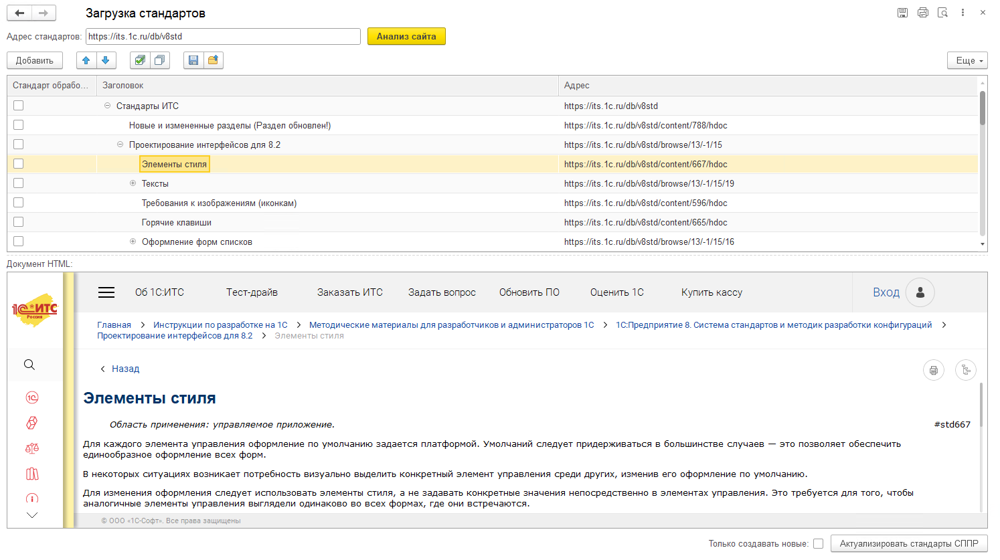
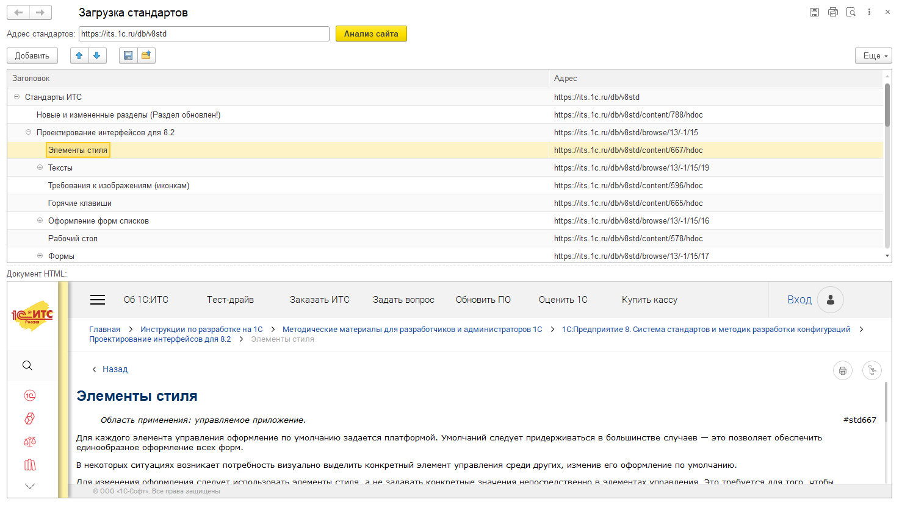

# 1C-Code-Standards-Parser

## Описание
Этот проект разработан для парсинга стандартов кода 1С с сайта [1С ИТС](https://its.1c.ru/db/v8std) и загрузки их в систему проектирования прикладных решений (СППР).
Разработка обкатана и применяется в компании [AUXO](https://www.auxo-it.ru/)

С помощью данной обработки можно автоматически загружать и обновлять стандарты в вашей конфигурации.

## Внешний вид
- Функционал СППР доступен (Есть возможность загрузки в конфигурацию):  
  
- Функционал СППР недоступен (Доступен только просмотр стандартов):  
  

## Установка
1. Перейдите в раздел [Releases](https://github.com/SAShikutkin/1C-Code-Standards-Parser/releases) и скачайте последнюю версию внешней обработки.
2. Вы можете открыть файл обработки как обычный файл (через меню "Файл" - "Открыть")
3. Вы можете добавить его в справочник `ДополнительныеОтчетыИОбработки` в вашей конфигурации, предварительно раскомментируйте в модуле объекта функцию "СведенияОВнешнейОбработке"

## Использование
1. Запустите обработку в 1С.
2. Нажмите кнопку "Анализ сайта". Эта кнопка выполняет GET-запросы к сайту и строит дерево стандартов.
3. После завершения анализа, нажмите кнопку "Актуализировать стандарты СППР" - Загрузит сформированное дерево стандартов в вашу конфигурацию СППР.

## Требования
- 1С:Предприятие 8.3.23 и выше. Т.к. Используются регулярные выражение.
- Internet-соединение
- Для загрузки стандартов в конфигурацию должен быть справочник "СтандартыРазработки". Также в этом справочнике должен быть реквизит "СсылкаНаСтандарт" (тип строка).

## Прочее

Прочитайте и поставьте + этой статье на Инфостарт - [Загрузка стандартов с ИТС](https://infostart.ru/public/2202706/)

По всем вопросам и предложениям в [Телеграм](https:/t.me/SAShikutkin)

[↑ Наверх](#Описание)